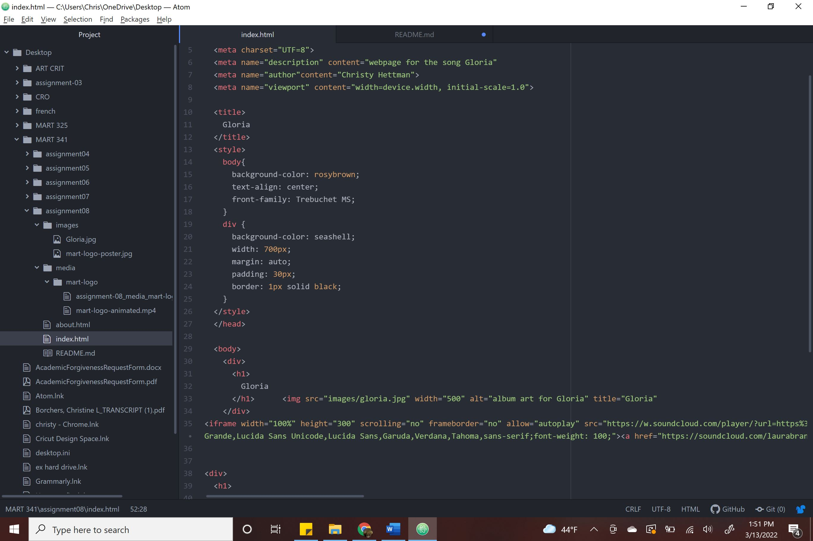

What is the difference between padding, margin, and borders?

If you think of a box the margin is the most outer layer, and the space around the border.
The border goes around the content.
Padding is the space in-between the content and border.

Optional: how did this week's assignment go? What challenges did you face, and how did you overcome them?

I had to really work to make sure everything lined up and was spaced the way I wanted. I am really liking this class and figuring out how to build and design! 
