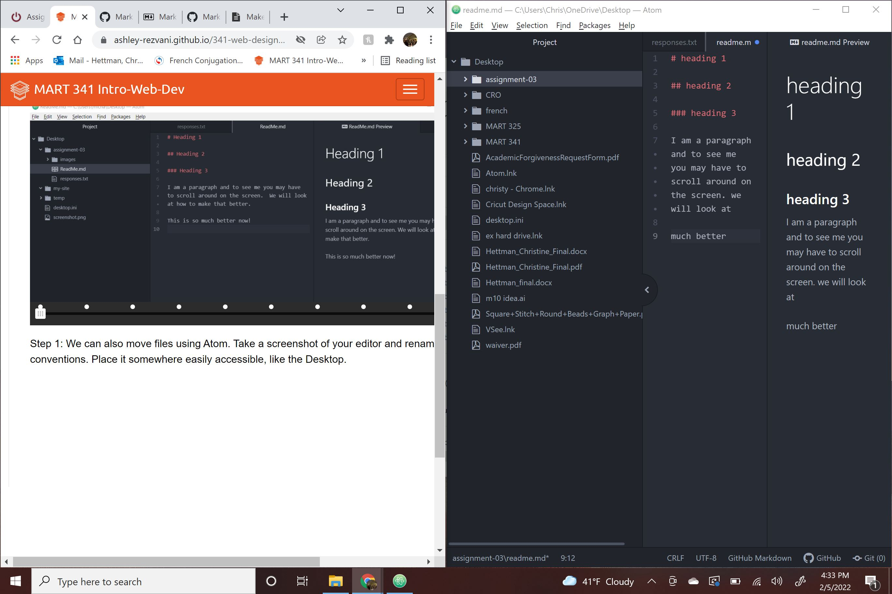

# heading 1

## heading 2

### heading 3

I am a paragraph and

much better

https://www.cromedicalgear.com/

[my responses](./responses.txt)

**three** things I have learned in this class so far.

**1** The internet is more complex than I originally thought.

**2** Working in Atom is easier for me than GitHub.

**3** I learned how to emphasize words **bold** *italic* __bold__ _italic_
