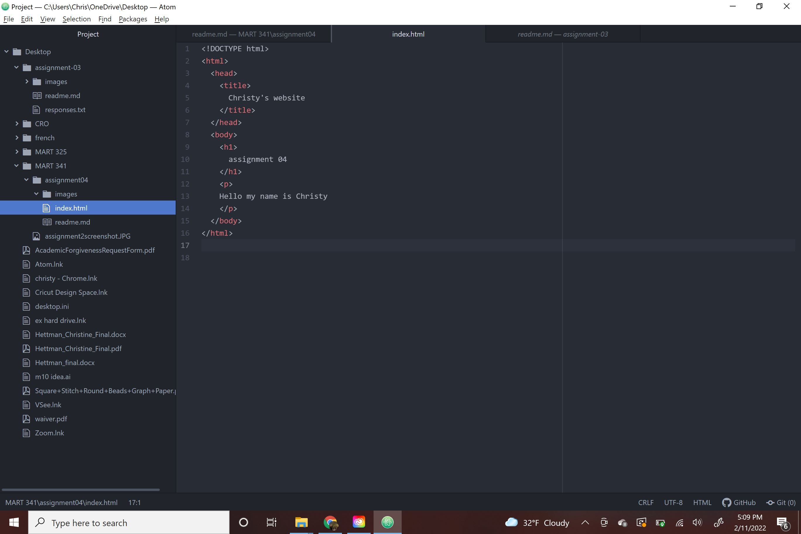

Very briefly detail how browsers function. List any browsers you currently use to surf - or even develop for - the web.

Web browsers receive a request over the network and send it to a server, then the server responds with content and sends it to your computer and your web browser interprets the content and displays a page. I use Chrome.

Link to your screenshot using a relative URL. (We did this last week, too! Check your assignment-03 directory if you can't remember how you did it).

