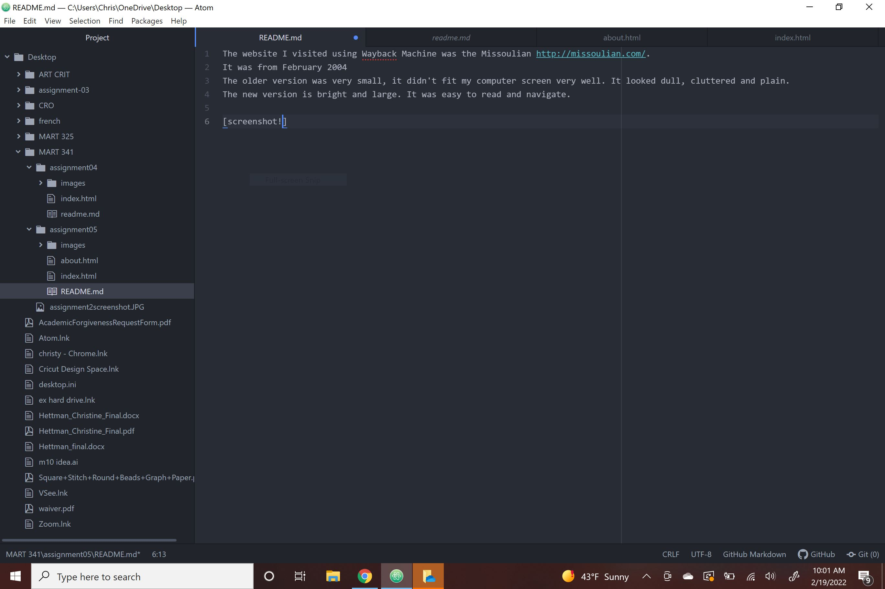

The website I visited using Wayback Machine was the Missoulian http://missoulian.com/.
It was from February 2004
The older version was very small, it didn't fit my computer screen very well. It looked dull, cluttered and plain.
The new version is bright and large. It was easy to read and navigate.

