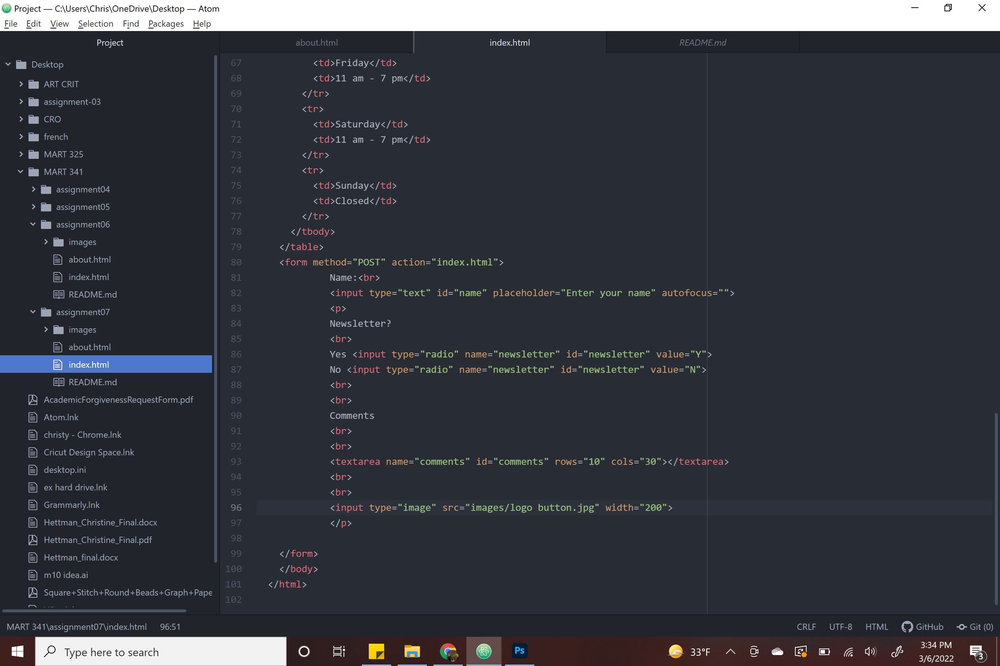

I found checkbox's, drop down lists, and password fields.
checkboxes can be used to select more than one option for a choice. Drop down lists can be used for the same and password fields are a way for a user to enter their password for a membership on a website.

These are also used for design by making the website usable or secure.
