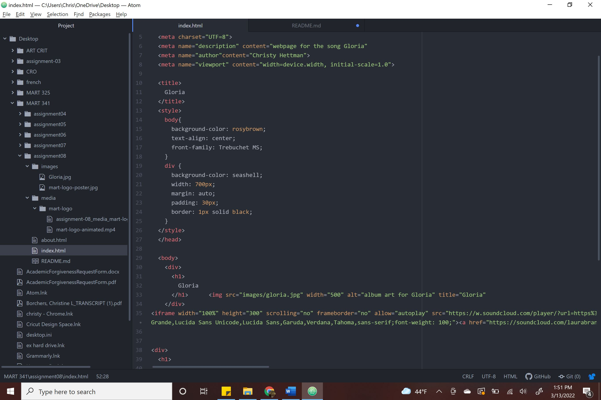

Affordance is what a user can do with an object, like the power symbol lets you know that is how you turn off something.

Advantages for using third-party services- You can use their music, videos or sound, and they have the code already written. Disadvantages are sometimes youtube videos wont work. I tried several different videos and none of them would work, most likely because of copyright issues.

I had a hard time making sure everything was right this time. There was a lot of parts that needed to be in the right order like the quotations or periods.
