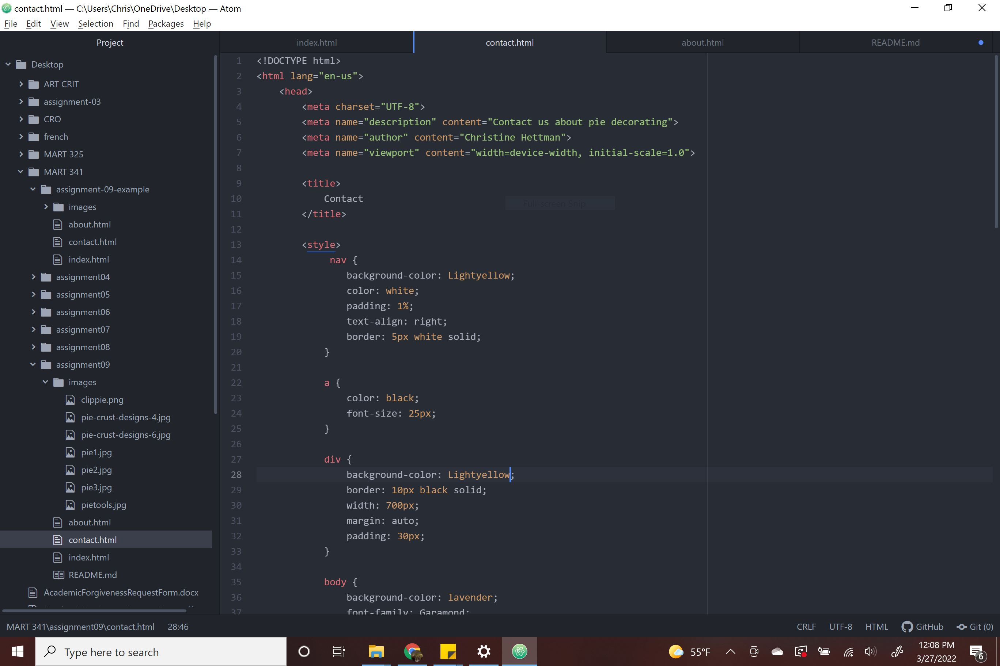

Briefly recap your experience learning HTML. What was old, new, interesting, or difficult to learn?
  I don't feel like anything is old, just getting the hang of doing the same thing each time I start is getting better. I am still having trouble getting everything typed in precisely so my code works, but I think I am doing better at double checking to make sure it works.   

After we come back from spring break we will start to dive into CSS and expand on styling, which helps us "decorate" HTML. Is there anything you're anxious or excited to learn about in this new section?

  I am really excited for CSS, I love looking up CSS codes for colors so I cant wait to decorate more.
