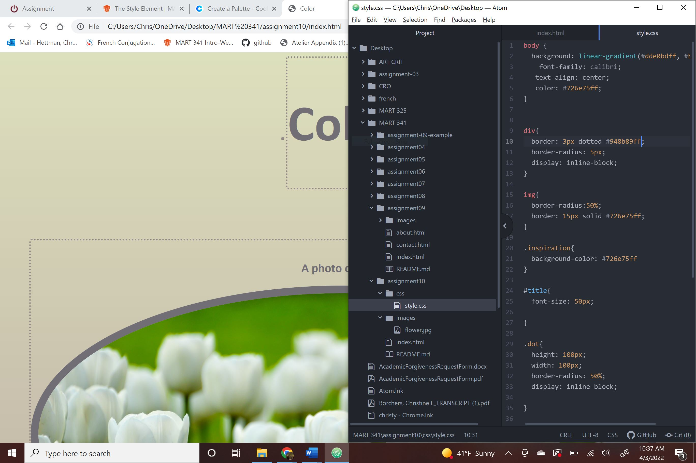

Describe the difference between the universal, element, class, and id selector types. When might you choose one over the other to style content?

Universal selectors are used to style every thing, so this can be used for something simple to keep everything the same.

Element selectors are used to select elements of a certain type. so all h2's will be styled the same if selected.

Class selectors are used to add style to elements, can select elements that serve the same function.

ID selectors define style rules for a specific element.

I think it depends on what you want. I think it would be easier to use the universal selectors to keep it simple, but if you want something well designed you should use a mix of the selectors to get the outcome you want.

Discuss your color palette. How did you choose your colors?
I chose these colors because I feel like I have been seeing them in fashion recently. I like following fashion and each season there is a new color forecast. Right now I am seeing a lot of muted pinks and purples and I really like them. These colors also remind me of spring.

Optional: discuss any challenges you faced this week, and how you overcame them.
I had so much fun looking into CSS styling that I kept messing up my codes. I think this was a good learning experience because it took me a long time to figure out how to fix it so it would display right. I also liked that I am really seeing how things lay out in the page because of the styling. I placed emojis in my code and had to move them a lot to get them where I wanted them, I also liked the use of the breaks and figuring out how to place them.
